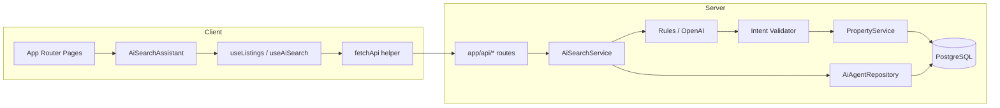
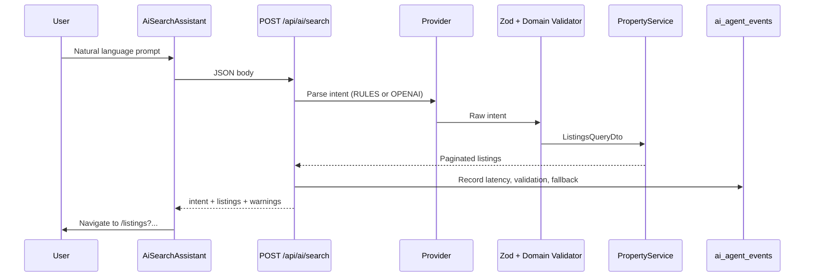

# NestFind

**Find your perfect stay** — a modern property discovery platform for apartments, studios, and homes across Vietnam.

NestFind is a full-stack property discovery platform with an **AI search assistant** that turns natural language into validated listing filters, plus **production agent monitoring** for observability.

---

## Product & scope (SDLC)

### Problem the AI feature solves

Renters often describe stays in plain language (“studio in Hanoi for 2 under $50”) while traditional forms require discrete fields. **NestFind AI Concierge** bridges that gap: it interprets the prompt, extracts structured search intent, validates it against platform rules, and runs the same listing pipeline as manual filters.

### User intent & assumptions

| Assumption | Rationale |
|------------|-----------|
| Primary markets are **Hanoi, Ho Chi Minh City, Da Nang** | Matches seed data and Vietnam-focused UX |
| Users may omit dates in AI prompts | MVP maps intent to location, type, guests, and price — not booking dates |
| AI output must be **machine-checkable** | Every provider response passes Zod + domain validation before querying PostgreSQL |
| OpenAI is **optional** | Rule-based parser works offline; `OPENAI_API_KEY` enables LLM intent when set |

### Why this implementation

- **Rule-based default** — Deterministic, testable, no API key required for reviewers.
- **Optional OpenAI** — Same validated schema; failures fall back to rules.
- **Single source of truth** — Validated intent → `ListingsQueryDto` → existing `PropertyService` (no duplicate search logic).
- **Observable by design** — Each AI request is recorded in `ai_agent_events` for `/api/ai/metrics`.

---

## Project Overview

NestFind helps renters browse curated listings by city, property type, price, and guest capacity. The homepage surfaces hero search, category shortcuts, platform stats, and featured properties; dedicated listing pages support filtering and full-text search; property detail pages present rich listing information.

The project intentionally separates **presentation** (React Server and Client Components), **HTTP** (thin App Router route handlers), and **domain logic** (services, repositories, Prisma). That split keeps changes predictable for human developers and coding agents alike.

**Why NestFind exists**

| Goal | How the repo delivers |
|------|------------------------|
| Realistic rental UX | Pixel-aligned UI with Vietnam-focused seed data (Hanoi, Ho Chi Minh City, Da Nang) |
| Production API patterns | Zod-validated DTOs, consistent JSON envelopes, typed errors |
| Maintainable data model | Normalized `City` → `District` → `Property` schema with pricing and images |
| Confidence in changes | E2E flows, API contract tests, accessibility checks, and CI on every PR |

---

## Features

- **AI search assistant** — Natural language → validated filters → listings (homepage hero)
- **Homepage** — Hero search, category chips, live stats, featured listing grid, map CTA modal
- **Listings browse** — Debounced search, filters (location, type, guests, featured, price signals), paginated results
- **Property detail** — Server-rendered detail pages with loading and not-found states
- **REST API** — Listings, search, filter metadata, stats, health, **AI search**, **AI metrics**
- **Data layer** — PostgreSQL via Prisma with idempotent seed script
- **Quality gates** — Unit tests (AI validation), Playwright smoke/flow/API/a11y/responsive

---

## Tech Stack

| Layer | Technology |
|-------|------------|
| Framework | [Next.js 15](https://nextjs.org) (App Router, Turbopack) |
| UI | [React 19](https://react.dev), [Tailwind CSS v4](https://tailwindcss.com), [Radix UI](https://www.radix-ui.com) |
| Language | TypeScript 5 |
| Database | PostgreSQL 16 + [Prisma 6](https://www.prisma.io) |
| Validation | [Zod 4](https://zod.dev) |
| E2E / QA | [Playwright](https://playwright.dev), [@axe-core/playwright](https://github.com/dequelabs/axe-core-npm) |
| Fonts | Geist (via `next/font`) |

---

## Architecture

NestFind follows a **unidirectional request flow** on the server and a **feature-oriented** structure on the client.



### AI request flow



### Backend (API)

```
Route → DTO validation → Service → Repository → Prisma → PostgreSQL
```

| Directory | Responsibility |
|-----------|----------------|
| `src/app/api/` | Thin HTTP handlers only |
| `src/server/dto/` | Query/path parsing and validation |
| `src/server/services/` | Business rules and orchestration |
| `src/server/repositories/` | Prisma queries and `where` builders |
| `src/server/mappers/` | Prisma models → domain `Listing` types |
| `src/server/errors/` | `AppError`, error codes, route error mapping |
| `prisma/` | Schema, migrations, seed |

All successful API responses use `{ "success": true, "data": ... }`. Errors return `{ "success": false, "error": { "message", "code" } }`. See [docs/BACKEND.md](docs/BACKEND.md) for endpoint reference and examples.

### Frontend

```
src/app/          → Routes (RSC + client islands)
src/components/   → common | features | layout | ui
src/hooks/        → Data fetching and UX utilities
src/lib/          → API client, filters, formatting
src/types/        → Shared domain types
```

Server Components load data where possible; interactive surfaces (search, filters, modals) are Client Components. Design tokens and NestFind brand colors live in `src/app/globals.css`. See [FRONTEND.md](FRONTEND.md) for component inventory.

### Testing

```
e2e/
├── pages/       Page Object Model
├── fixtures/    Custom Playwright fixtures
├── tests/       smoke | flows | api | states | a11y | responsive
└── global-setup.ts   Resolves listing IDs from live API
```

Details: [e2e/README.md](e2e/README.md).

### AI validation & tests

| Layer | What it verifies |
|-------|------------------|
| **Zod** (`aiSearchIntentRawSchema`) | Shape, bounds, required `summary` + `confidence` |
| **Domain validator** | Known city slugs, price clamp/swap, low-confidence warnings |
| **Fallback** | Invalid LLM JSON → rule-based parser |
| **Unit** | `npm run test:unit` — `src/server/ai/validation/intent-validator.test.ts` |
| **API E2E** | `e2e/tests/api/ai-api.spec.ts` — intent + metrics contract |
| **UI flow** | `e2e/tests/flows/ai-search.spec.ts` — assistant → listings page |

### Production agent monitoring

`GET /api/ai/metrics?windowHours=24` aggregates `ai_agent_events`:

- Success rate, validation pass rate, fallback rate
- Avg / p50 / p95 latency
- Breakdown by provider (`RULES` | `OPENAI`)
- Recent failures (last 10)

Disable DB writes with `AI_MONITOR_ENABLED=false` (metrics return empty aggregates).

### Evaluation & roadmap

| Area | Current | Next steps |
|------|---------|------------|
| **Scale** | Sync POST per search | Queue + cache frequent prompts; edge rate limits |
| **Monitor** | Postgres aggregates | Export to Datadog/Prometheus; alert on fallback rate ↑ |
| **AI quality** | Schema + domain rules | Golden prompt suite; human review queue for confidence &lt; 0.5 |
| **Edge cases** | Unknown city → warning | Clarifying questions UI; multilingual prompts |

### Repository layout

```
nestfind-app/
├── prisma/              Schema, migrations, seed
├── src/
│   ├── app/             Pages + API routes
│   ├── components/      UI by feature
│   ├── hooks/
│   ├── lib/
│   ├── server/          Backend layers
│   └── types/
├── e2e/                 Playwright suite
├── docs/                Backend deep-dive
├── scripts/ci/          Local CI helpers
└── .github/workflows/   GitHub Actions
```

---

## Setup Instructions

### Prerequisites

- **Node.js 20+**
- **PostgreSQL 16** (local install, Docker, or cloud)
- **npm** (ships with Node)

### 1. Clone and install

```bash
git clone <your-repo-url> nestfind-app
cd nestfind-app
npm install
```

`postinstall` runs `prisma generate` automatically.

### 2. Configure environment

```bash
cp .env.example .env
```

Edit `DATABASE_URL` for your PostgreSQL instance. On macOS with Homebrew PostgreSQL, the username is often your OS user (`whoami`), not `postgres`.

### 3. Prepare the database

**Option A — push schema (fastest for local dev)**

```bash
npm run db:push
npm run db:seed
```

**Option B — migrations (recommended for teams / CI parity)**

```bash
npm run db:migrate
npm run db:seed
```

### 4. Start the app

```bash
npm run dev
```

Open [http://localhost:3000](http://localhost:3000).

### 5. (Optional) Run E2E tests locally

```bash
npm run test:e2e:install
npm run test:e2e
```

Or use the CI script (migrations + seed + Playwright with `CI=true`):

```bash
chmod +x scripts/ci/e2e.sh
./scripts/ci/e2e.sh
```

---

## Environment Variables

| Variable | Required | Description |
|----------|----------|-------------|
| `DATABASE_URL` | Yes | PostgreSQL connection string (`?schema=public`) |
| `STATS_BASELINE_LISTINGS` | No | Display baseline when DB row count is low (default seed uses real counts when populated) |
| `STATS_BASELINE_CITIES` | No | Same for city count on stats cards |
| `PLAYWRIGHT_BASE_URL` | No | E2E base URL (default `http://127.0.0.1:3000`) |
| `CI` | No | Set in CI; enables Playwright retries, production build in webServer |
| `OPENAI_API_KEY` | No | Enables OpenAI intent parser; omit to use rules-only |
| `OPENAI_MODEL` | No | OpenAI model (default `gpt-4o-mini`) |
| `AI_MONITOR_ENABLED` | No | Persist agent events (default `true`) |

Example `.env`:

```env
DATABASE_URL="postgresql://YOUR_USER@localhost:5432/nestfind?schema=public"
STATS_BASELINE_LISTINGS=12400
STATS_BASELINE_CITIES=48
```

Never commit `.env` or secrets. Use `.env.example` as the template.

---

## Scripts

| Script | Description |
|--------|-------------|
| `npm run dev` | Start dev server (Turbopack) |
| `npm run build` | `prisma generate` + production build |
| `npm run start` | Run production server |
| `npm run lint` | ESLint (Next.js config) |
| `npm run db:generate` | Generate Prisma Client |
| `npm run db:push` | Push schema to DB (no migration files) |
| `npm run db:migrate` | Create/apply dev migrations |
| `npm run db:seed` | Seed cities, districts, and sample properties |
| `npm run db:studio` | Open Prisma Studio |
| `npm run test:e2e` | Full Playwright suite |
| `npm run test:e2e:smoke` | Smoke tests only |
| `npm run test:e2e:api` | API contract project (listings + AI) |
| `npm run test:unit` | AI intent validation unit tests |
| `npm run test:e2e:mobile` | Mobile viewport project |
| `npm run test:e2e:ui` | Playwright UI mode |
| `npm run test:e2e:report` | Open HTML report |

---

## Deployment

### Application (Next.js)

NestFind is a standard Next.js 15 app and deploys cleanly to [Vercel](https://vercel.com) or any Node host that supports `next build` / `next start`.

1. Provision a **managed PostgreSQL** database.
2. Set `DATABASE_URL` in the hosting provider.
3. Run migrations against production:

   ```bash
   npx prisma migrate deploy
   ```

4. Seed only if you need demo data in non-production environments.
5. Build: `npm run build` → Start: `npm run start`.

Remote images are allowed from `images.unsplash.com` (see `next.config.ts`).

### CI

GitHub Actions workflow [`.github/workflows/e2e.yml`](.github/workflows/e2e.yml) runs on pushes and PRs to `main` / `master`:

- Spins up PostgreSQL 16
- Applies migrations and seed
- Builds the app and runs the full Playwright suite

Use this workflow as the merge gate before shipping UI or API changes.

---

## AI-Agent Workflow

This repository is structured so **coding agents** (Cursor, Copilot, Claude Code, etc.) can make safe, reviewable changes without guessing conventions.

### 1. Read context first

| Task type | Start here |
|-----------|------------|
| API / DB / services | [docs/BACKEND.md](docs/BACKEND.md), `prisma/schema.prisma` |
| UI / components | [docs/FRONTEND.md](FRONTEND.md), `src/components/features/` |
| Tests / regressions | [e2e/README.md](e2e/README.md), `e2e/utils/selectors.ts` |

### 2. Respect layer boundaries

- **Do** add business logic in `src/server/services/`, queries in `src/server/repositories/`.
- **Do** keep `src/app/api/**/route.ts` handlers thin (parse → service → `successResponse`).
- **Do** validate inputs with Zod DTOs in `src/server/dto/`.
- **Do not** call Prisma directly from route handlers or React components.
- **Do not** bypass the API envelope; use `fetchApi` on the client.

### 3. UI and testability

- Prefer **`data-testid`** attributes for new interactive elements (see `e2e/utils/selectors.ts`).
- Reuse existing UI primitives under `src/components/ui/`.
- Match NestFind tokens in `globals.css` (`--nestfind-green`, `--nestfind-hero`, etc.).

### 4. Data changes

1. Edit `prisma/schema.prisma`.
2. Create migration: `npm run db:migrate`.
3. Update seed in `prisma/seed.ts` if sample data should reflect the change.
4. Adjust mappers/DTOs/services if shapes changed.

After re-seeding, E2E fixture IDs refresh via `e2e/global-setup.ts`; delete `e2e/.artifacts/` if tests behave stale.

### 5. Verification before merge

Run the smallest relevant checks:

```bash
npm run lint
npm run build
npm run test:e2e:smoke    # quick UI sanity
npm run test:e2e:api      # if API contracts changed
npm run test:e2e          # before significant UI/API work
```

### 6. Suggested agent task prompts

- *"Add filter X to listings API: DTO → repository where → service → route → hook → ListingFilters UI → API e2e spec."*
- *"Fix empty state on listings page; add `data-testid`; extend `e2e/tests/states/empty-state.spec.ts`."*
- *"Document new endpoint in `docs/BACKEND.md` and add curl example."*

Keeping changes vertical (schema → API → UI → test) reduces drift and matches how the codebase is already organized.

---

## Future Improvements

- **Authentication** — Sign up / sign in, saved listings, host dashboard
- **Booking flow** — Availability calendar, reservations, payments
- **Maps** — Live map integration (Mapbox / Google Maps) replacing placeholder modal
- **Media** — Upload pipeline and CDN-backed property galleries
- **Search** — PostgreSQL full-text or dedicated search (Meilisearch, Typesense)
- **AI** — Conversational refinement, saved prompts, RAG over listing descriptions
- **Observability** — OpenTelemetry traces from AI route; Sentry for provider failures
- **Internationalization** — Vietnamese + English locale support
- **Admin** — Listing CRUD, moderation, analytics
- **Performance** — Edge caching, ISR for listing pages, image optimization policies

---

## API quick reference

| Method | Path | Description |
|--------|------|-------------|
| `GET` | `/api/health` | Liveness + DB connectivity |
| `GET` | `/api/stats` | Platform statistics |
| `GET` | `/api/listings` | Paginated listings + filters |
| `GET` | `/api/listings/search` | Full-text search (`q`) |
| `GET` | `/api/listings/filters` | Filter metadata |
| `GET` | `/api/listings/:id` | Property detail |
| `POST` | `/api/ai/search` | Natural language → validated intent + listings |
| `GET` | `/api/ai/metrics` | AI agent monitoring aggregates |

```bash
curl "http://localhost:3000/api/listings?city=hanoi&featured=true&limit=4"
curl "http://localhost:3000/api/listings/search?q=studio"
curl "http://localhost:3000/api/health"
curl -X POST http://localhost:3000/api/ai/search \
  -H "Content-Type: application/json" \
  -d '{"prompt":"Studio in Hanoi for 2 guests under $45"}'
curl "http://localhost:3000/api/ai/metrics?windowHours=24"
```

---

## License

Private project (`"private": true` in `package.json`). Add a license file if you open-source the repository.

---

**NestFind** — built for clarity, testability, and teams that ship with humans and agents side by side.
